Lima, [DÍA] de octubre de 2026

**CARTA N.° [___]-2026-ABS BIENES & SERVICIOS E.I.R.L.**

Señores
**DIRECCIÓN DE COMPRAS ELECTRÓNICAS Y MODALIDADES EFICIENTES – DCEME**
Central de Compras Públicas – PERÚ COMPRAS
Av. República de Panamá N.° 3629, San Isidro
Presente.–

**ASUNTO:** RECLAMO POR DEMORA Y SOLICITUD DE PRONUNCIAMIENTO INMEDIATO sobre la solicitud de acreditación como representante de la marca **CAMPECHANO** – **Expediente N.° 2026-0005612**.

**REFERENCIAS:**

a) Carta N.° 30062026, del 30 de junio de 2026: solicitud de acreditación de la marca CAMPECHANO (Expediente N.° 2026-0005612).
b) Correo de PERÚ COMPRAS (acuerdosmarco@perucompras.gob.pe) del **13 de julio de 2026**, que notificó observaciones.
c) Carta N.° 19062026, del 19 de julio de 2026, de subsanación de observaciones, remitida el **20 de julio de 2026**.
d) Correos de seguimiento del **31 de agosto de 2026** y del **10 de septiembre de 2026**, sin respuesta.

---

De nuestra consideración:

**ABS BIENES & SERVICIOS E.I.R.L.**, con RUC N.° **20608727583**, debidamente representada por su Titular Gerente, **ABBY GABRIELA BUENO SALDAÑA**, identificada con DNI N.° **48054321**, se dirige a ustedes para presentar un **RECLAMO** por la demora en la atención de nuestra solicitud de acreditación como representante de la marca **CAMPECHANO**, y para solicitar que su Dirección **se pronuncie de inmediato**, conforme a los plazos que establece su propia normativa.

## 1. LOS HECHOS

**1.1.** El **30 de junio de 2026** solicitamos nuestra acreditación como representante de la marca **CAMPECHANO** en el Acuerdo Marco de **Cereales, Aceite, Azúcares y Menestras**, generándose el **Expediente N.° 2026-0005612**.

**1.2.** El **13 de julio de 2026**, su Dirección nos notificó observaciones por correo electrónico y, conforme al **numeral 8.2.2** de la Directiva N.° 004-2023-PERÚ COMPRAS, nos otorgó **cinco (5) días hábiles** para subsanarlas.

**1.3.** **Cumplimos dentro del plazo.** El **20 de julio de 2026** remitimos la Carta N.° 19062026, con la que atendimos **todas** las observaciones:

| Observación | Cómo la subsanamos |
|---|---|
| 1. Falta de registro de propiedad industrial en Clase Niza 29 (Frijol y Lenteja) | **Suprimimos** las categorías Frijol y Lenteja, como lo permitía la propia observación. |
| 2. y 3. Facultades del firmante de la Carta de Acreditación (Anexo 4) | Acreditamos que el firmante, Sr. **Manuel Antonio Miñan Huerto**, es **Gerente General de STYWI S.A.C.**, cuyos **únicos socios (50 % cada uno) y directores** son los **titulares registrados de la marca**, el Sr. William Nadim Majluf Tuma y la Sra. Stephanie Farah Ode (Ficha RUC adjunta). Adjuntamos además el **Certificado de Vigencia de SUNARP** (partida electrónica N.° 13409955, Oficina Registral de Lima – ver Anexo 5), en el que constan sus facultades **a sola firma** para representar **ante INDECOPI** y, en particular, **“en todos los asuntos relacionados con los derechos de propiedad intelectual”**, incluidos los **registros y renovaciones de marcas** (facultad 17). |
| 4. Catálogos y categorías (Anexo 1) | Corregimos el Anexo 1, indicando cada Catálogo Electrónico y su categoría: **Azúcar y Endulzantes – Azúcar** y **Cereales, Arroz y Derivados – Arroz Pilado**. |
| 5. Cuestionario de Debida Diligencia (Anexo 3) | Precisamos el domicilio legal completo, la dirección exacta de la oficina y el tipo de documento de identidad. |

**1.4.** Desde entonces **no hemos recibido ninguna respuesta**. Escribimos el **31 de agosto** y el **10 de septiembre de 2026** para consultar el estado del trámite, también a acreditacionrm@perucompras.gob.pe. **Ninguno de esos correos fue respondido.**

**1.5.** A la fecha han transcurrido **más de once (11) semanas** desde que presentamos la subsanación, y **más de tres (3) meses** desde que iniciamos el trámite.

## 2. LOS PLAZOS QUE SE HAN INCUMPLIDO

**2.1.** La **Directiva N.° 004-2023-PERÚ COMPRAS**, “Lineamientos para la acreditación como representante de marca y su gestión en los Catálogos Electrónicos de Acuerdos Marco”, aprobada por **Resolución Jefatural N.° 000085-2023-PERÚ COMPRAS-JEFATURA**, establece plazos claros y obligatorios para este procedimiento:

- **Numeral 8.2.3:** *“La Dirección de Acuerdos Marco, **dentro del plazo de diez (10) días hábiles**, contados a partir del día siguiente de presentada la subsanación, **verifica si el solicitante ha cumplido con subsanar todas las observaciones** (...)”*. Si considera que no se subsanaron, **desestima la solicitud y lo comunica**.
- **Numeral 8.2.4:** *“De no existir observaciones a la solicitud o habiendo sido subsanadas las que hubiere, la Dirección de Acuerdos Marco, **acredita al solicitante como representante de marca**”*, y le otorga su credencial de acceso a la plataforma.

**2.2.** Es decir, **en cualquiera de los dos casos su Dirección estaba obligada a pronunciarse dentro de los diez (10) días hábiles** siguientes al 20 de julio de 2026. **Ese plazo venció en agosto de 2026** y, hasta hoy, no tenemos ni la acreditación ni una comunicación que la deniegue.

**2.3.** La directiva exige a los solicitantes cumplir sus plazos **bajo sanción**: si no subsanamos en cinco (5) días hábiles, la solicitud se declara **no presentada** (numeral 8.2.2). Nosotros cumplimos ese plazo. Corresponde que la entidad **cumpla también el suyo**. El **numeral VI** de la misma Directiva señala que **son responsables de su cumplimiento los servidores civiles de la Dirección** a cargo de los Catálogos Electrónicos.

**2.4.** La falta de respuesta a nuestra subsanación y a nuestros correos de seguimiento vulnera además nuestro **derecho de petición**, reconocido en el **artículo 2, inciso 20 de la Constitución Política del Perú** y en el **TUO de la Ley N.° 27444, Ley del Procedimiento Administrativo General**, que obliga a la Administración a resolver dentro de los plazos establecidos.

**2.5.** Esta demora nos causa un **perjuicio directo**: mientras no seamos acreditados, **no podemos registrar las fichas-producto de la marca CAMPECHANO** ni los proveedores pueden ofertarlas en el catálogo. Cada periodo de carga que pasa es una oportunidad de venta perdida.

## 3. LO QUE SOLICITAMOS

Por lo expuesto, **SOLICITAMOS** que en un plazo **no mayor de cinco (5) días hábiles** desde la recepción de la presente:

1. Su Dirección **emita pronunciamiento** sobre el Expediente N.° 2026-0005612, conforme a los numerales **8.2.3 y 8.2.4** de la Directiva N.° 004-2023-PERÚ COMPRAS, y, habiendo sido subsanadas todas las observaciones, **nos acredite como representante de la marca CAMPECHANO** en las categorías **Azúcar** y **Arroz Pilado**, otorgándonos la credencial correspondiente.
2. Si su Dirección considera que alguna observación **no fue subsanada**, nos lo **comunique por escrito**, indicando **cuál y por qué**, para ejercer nuestro derecho de defensa.
3. Se nos **informe por escrito** el **motivo de la demora** y el **área o funcionario a cargo** de nuestro expediente.

## 4. RESERVA DE DERECHOS

De no recibir respuesta en el plazo indicado, **nos reservamos el derecho de presentar una queja por defecto de tramitación** conforme al TUO de la Ley N.° 27444, de acudir al **Órgano de Control Institucional (OCI) de PERÚ COMPRAS** y a la **Defensoría del Pueblo**, y de ejercer las demás acciones que la ley nos permite.

Confiamos en que su Dirección atenderá este pedido a la brevedad.

Atentamente,

&nbsp;

&nbsp;

\_\_\_\_\_\_\_\_\_\_\_\_\_\_\_\_\_\_\_\_\_\_\_\_\_\_\_\_\_\_\_\_\_\_\_
**ABBY GABRIELA BUENO SALDAÑA**
DNI N.° 48054321
Titular Gerente
**ABS BIENES & SERVICIOS E.I.R.L.** – RUC N.° 20608727583
Domicilio: Calle Giuseppe Verdi N.° 951, Urb. Primavera, Trujillo, La Libertad
Correo: abs.comercial2@gmail.com · Teléfono: [___________]

---

**ANEXOS:**

- **Anexo 1:** Carta N.° 30062026, del 30 de junio de 2026 (solicitud de acreditación).
- **Anexo 2:** Correo de PERÚ COMPRAS del 13 de julio de 2026 (observaciones).
- **Anexo 3:** Carta N.° 19062026 de subsanación, remitida el 20 de julio de 2026.
- **Anexo 4:** Correos de seguimiento del 31 de agosto y del 10 de septiembre de 2026.
- **Anexo 5:** Certificado de Vigencia de SUNARP de STYWI S.A.C. (partida electrónica N.° 13409955, Lima), que acredita las facultades del Sr. Manuel Antonio Miñan Huerto, incluida su representación ante INDECOPI.

```{=openxml}
<w:p><w:r><w:br w:type="page"/></w:r></w:p>
```

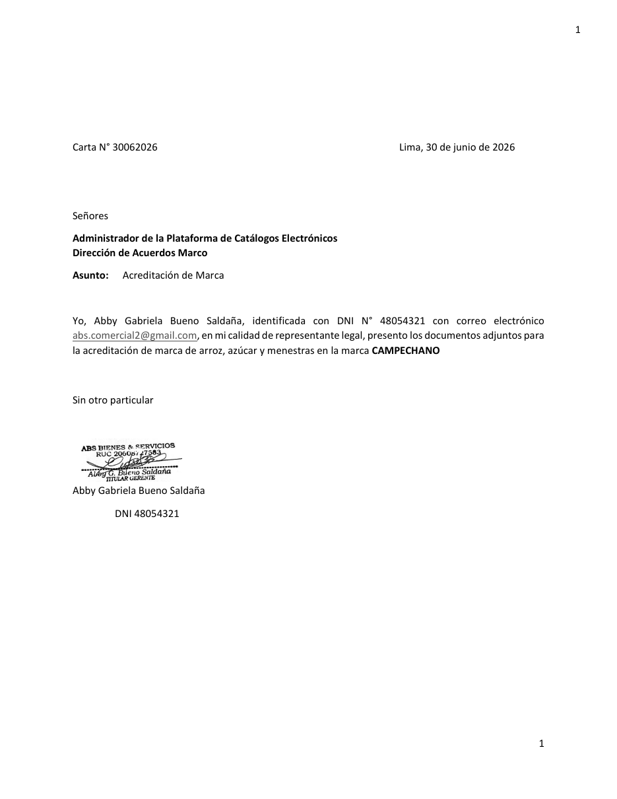{width=13cm}

**Anexo 1 – Carta N.° 30062026, del 30 de junio de 2026 (solicitud de acreditación).**

```{=openxml}
<w:p><w:r><w:br w:type="page"/></w:r></w:p>
```

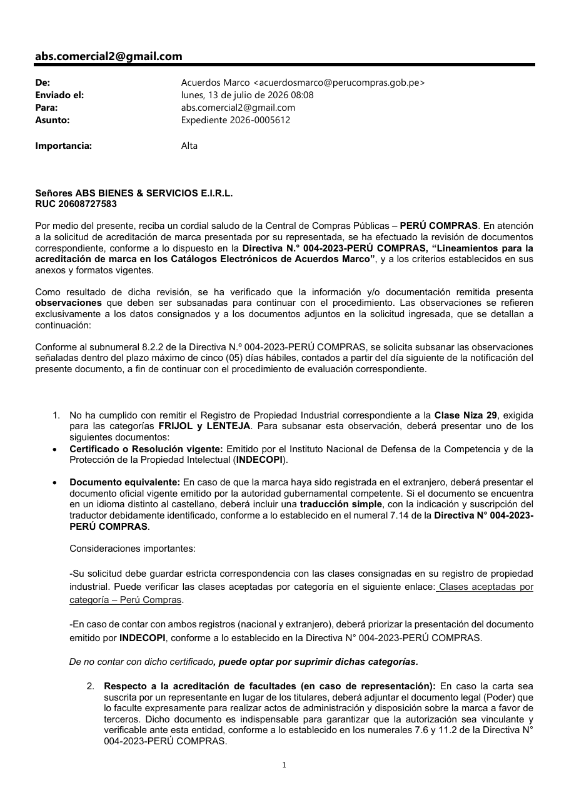{width=13cm}

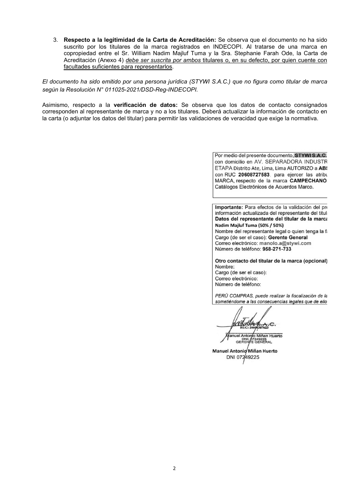{width=13cm}

**Anexo 2 – Correo de PERÚ COMPRAS del 13 de julio de 2026, que notifica observaciones y otorga 5 días hábiles para subsanar.**

```{=openxml}
<w:p><w:r><w:br w:type="page"/></w:r></w:p>
```

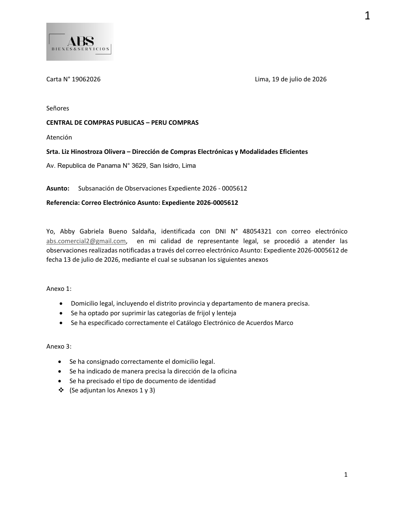{width=13cm}

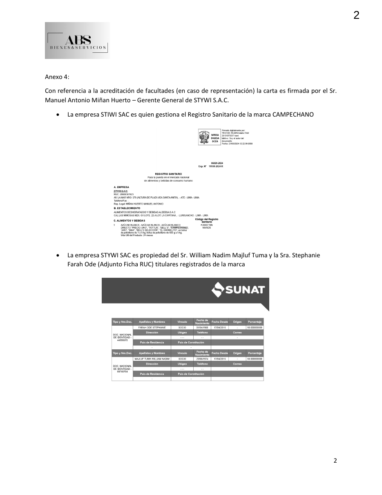{width=13cm}

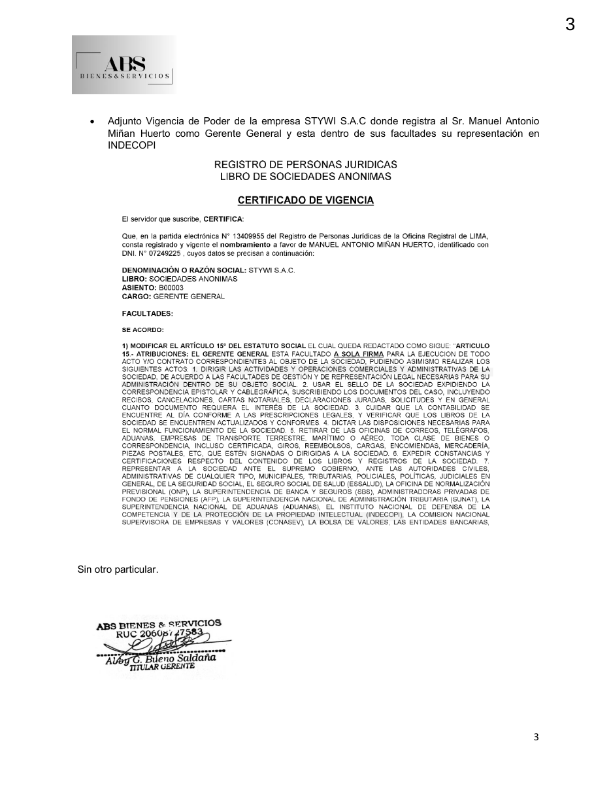{width=13cm}

**Anexo 3 – Carta N.° 19062026 de subsanación de observaciones (Expediente N.° 2026-0005612).**

```{=openxml}
<w:p><w:r><w:br w:type="page"/></w:r></w:p>
```

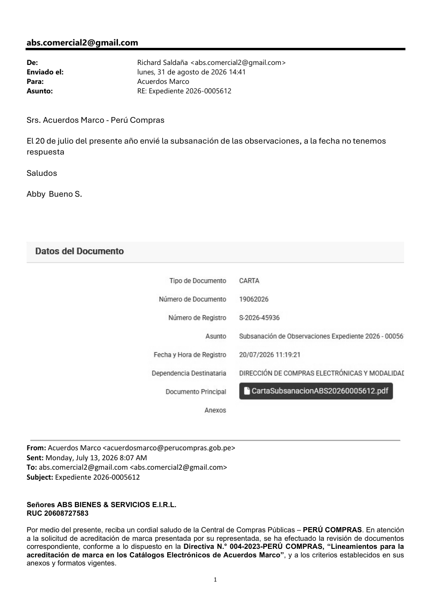{width=13cm}

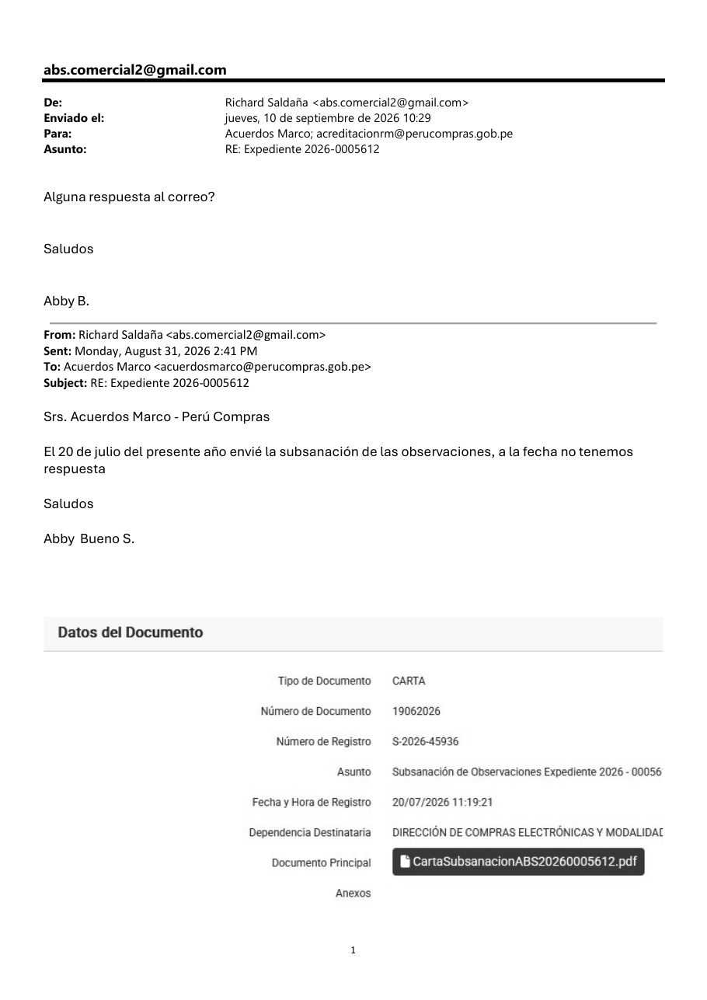{width=13cm}

**Anexo 4 – Correos de seguimiento del 31 de agosto de 2026 y del 10 de septiembre de 2026, sin respuesta.**

```{=openxml}
<w:p><w:r><w:br w:type="page"/></w:r></w:p>
```

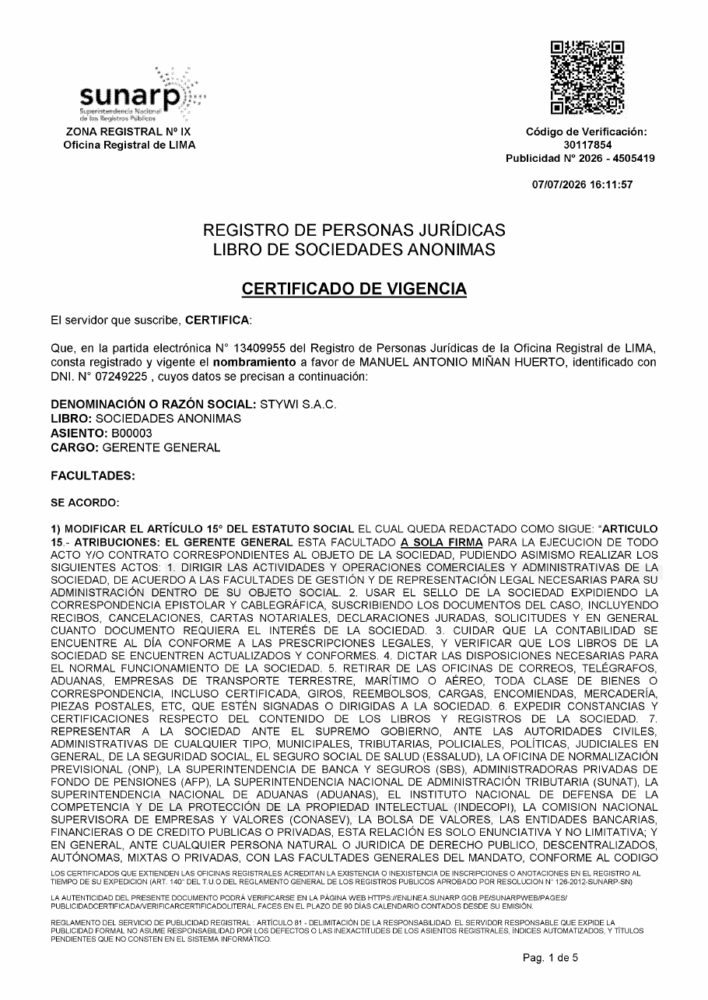{width=13cm}

**Anexo 5 – Certificado de Vigencia de SUNARP de STYWI S.A.C. (partida N.° 13409955): nombramiento de Manuel Antonio Miñan Huerto como Gerente General, a sola firma, con facultad de representación ante INDECOPI (facultad 7).**

```{=openxml}
<w:p><w:r><w:br w:type="page"/></w:r></w:p>
```

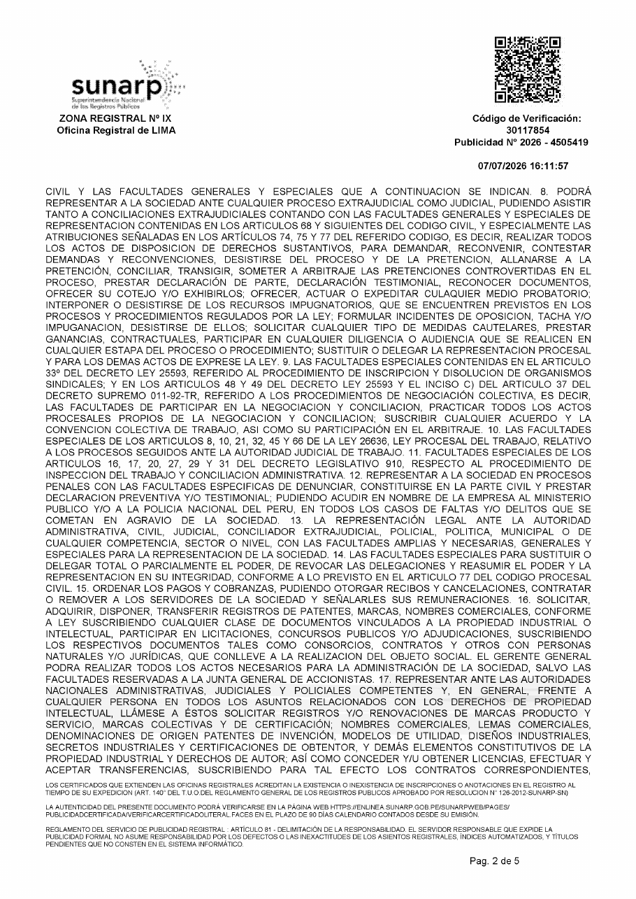{width=13cm}

**Anexo 5 (cont.) – Facultad 17: representación “en todos los asuntos relacionados con los derechos de propiedad intelectual”, incluidos registros y renovaciones de marcas.**

```{=openxml}
<w:p><w:r><w:br w:type="page"/></w:r></w:p>
```

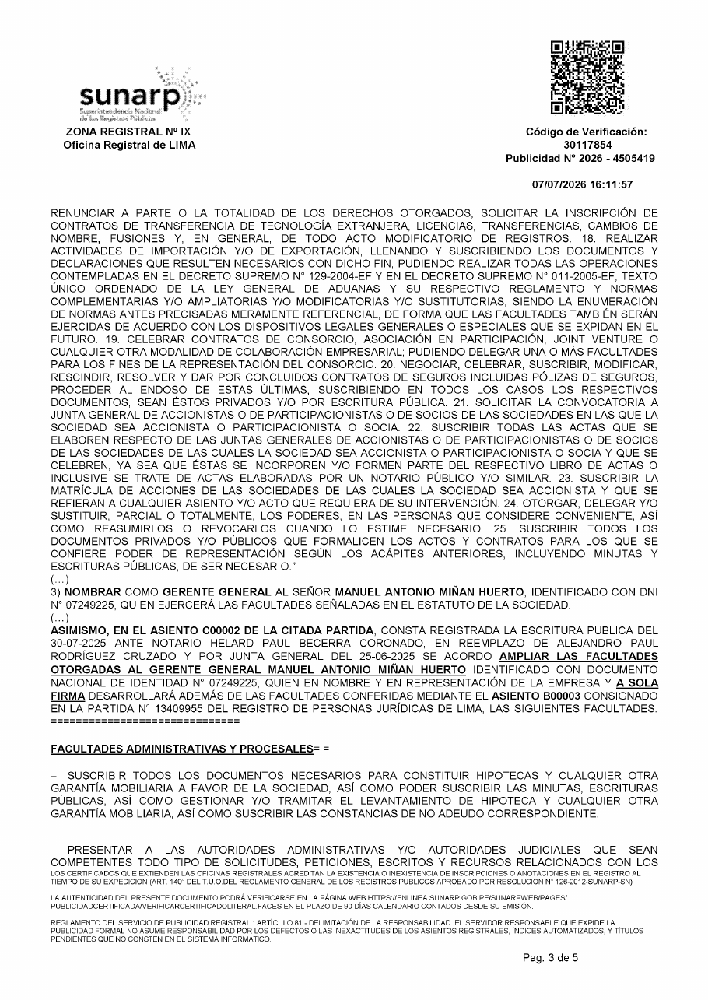{width=13cm}

**Anexo 5 (cont.) – Ampliación de facultades del Gerente General (asiento C00002).**
