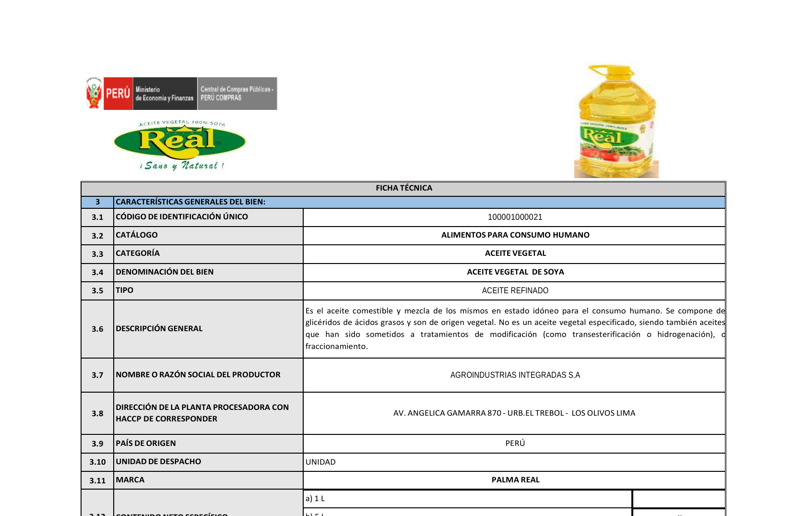
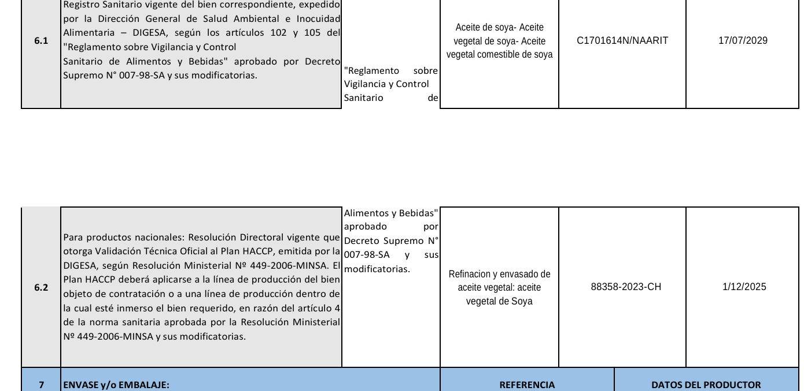
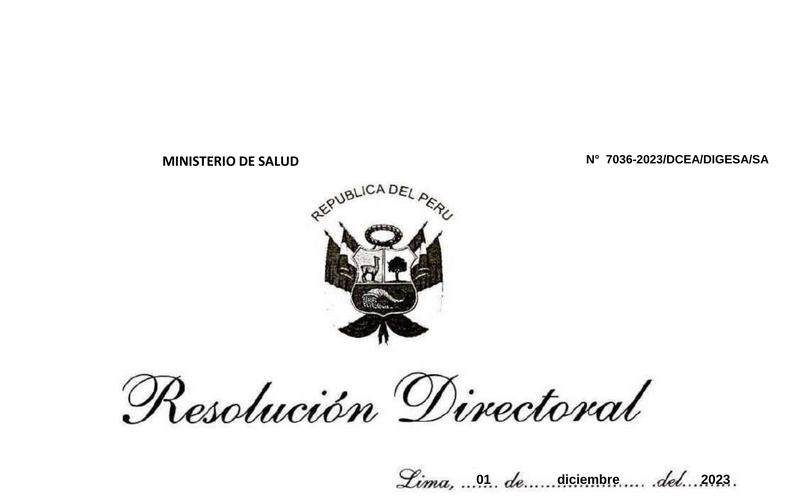
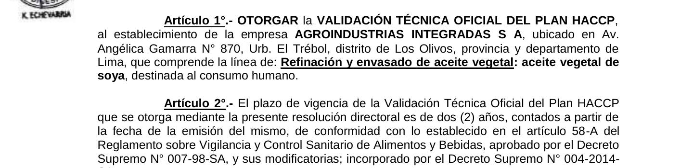

Lima, [DÍA] de octubre de 2026

**CARTA N.° [___]-2026-SERVICIOS BARTEK E.I.R.L.**

Señores
**DIRECCIÓN DE COMPRAS ELECTRÓNICAS Y MODALIDADES EFICIENTES – DCEME**
Central de Compras Públicas – PERÚ COMPRAS
Av. República de Panamá N.° 3629, San Isidro
Presente.–

**ASUNTO:** RECLAMO POR FALTA DE RESPUESTA Y SOLICITUD DE ACCIÓN INMEDIATA. Ficha-producto de aceite vegetal de la marca **PALMA REAL** publicada con **Plan HACCP vencido desde el 01 de diciembre de 2025**.

**REFERENCIAS:**

a) Carta N.° 23032026-03, ingresada por mesa de partes el **23 de marzo de 2026** (Exp. N.° **2026-0002646**).
b) Correo electrónico del **19 de agosto de 2026** dirigido a administrador.acuerdos, “HACCP desactualizado y Carta sin respuesta”.

---

De nuestra consideración:

**SERVICIOS BARTEK E.I.R.L.**, con RUC N.° **20610900551**, representante de marca acreditado ante PERÚ COMPRAS, debidamente representada por su Gerente, **FAVIOLA ORIHUELA PIMENTEL**, identificada con DNI N.° **10790531**, se dirige a ustedes para presentar un **RECLAMO** por la falta de atención a la denuncia que formulamos hace **más de seis meses**, sobre un hecho que involucra la **inocuidad de un alimento de consumo humano** que se vende al Estado a través de los Catálogos Electrónicos.

## 1. LOS HECHOS

**1.1.** En el Catálogo Electrónico se encuentra publicada la ficha-producto de **ACEITE VEGETAL DE SOYA, marca PALMA REAL**, categoría **ACEITE VEGETAL**, producida por **AGROINDUSTRIAS INTEGRADAS S.A.** (código de identificación único **100001000021**, según la ficha técnica publicada) [*confirmar Acuerdo Marco y catálogo vigentes: EXT-CE-2024-18 – Aceites y Grasas*].

**1.2.** La propia ficha técnica exige, en su numeral **6.2 – Documentos de habilitación**, lo siguiente:

> *“Para productos nacionales: **Resolución Directoral vigente** que otorga Validación Técnica Oficial al Plan HACCP, emitida por la DIGESA, según Resolución Ministerial N.° 449-2006-MINSA.”*

**1.3.** Sin embargo, el documento que figura en la ficha publicada es el **Expediente N.° 88358-2023-CH**, que corresponde a la **Resolución Directoral N.° 7036-2023/DCEA/DIGESA/SA, del 01 de diciembre de 2023**. En la misma ficha se declara como vigencia el **01/12/2025** (ver Anexo 1).

**1.4.** La propia resolución de DIGESA lo confirma. Su **Artículo 2** establece que la validación del Plan HACCP tiene una vigencia de **dos (2) años contados desde su emisión** (ver Anexo 2). Es decir, **venció el 01 de diciembre de 2025**. A la fecha, la ficha lleva **más de diez (10) meses** publicada con un documento sanitario de habilitación **vencido**.

**1.5.** Informamos este hecho a su Dirección el **23 de marzo de 2026**, mediante carta ingresada por mesa de partes (Exp. N.° 2026-0002646), y lo reiteramos por correo el **19 de agosto de 2026**. **Hasta hoy no hemos recibido ninguna respuesta**, y la ficha sigue publicada en las mismas condiciones.

## 2. LAS NORMAS QUE SE ESTÁN INCUMPLIENDO

**2.1. En alimentos, el HACCP no es un trámite: es la garantía de inocuidad.** El Plan HACCP (Análisis de Peligros y Puntos Críticos de Control) es el sistema que asegura que la línea de producción **identifica y controla los peligros físicos, químicos y biológicos** que pueden contaminar un alimento. Su validación la otorga **DIGESA**, luego de inspeccionar la planta, y **vence a los dos (2) años** justamente para obligar al productor a **demostrar periódicamente** que sigue cumpliendo. Por eso:

- La normativa sanitaria establece que un establecimiento con HACCP validado **se considera habilitado sanitariamente solo para esa línea de producción**, tal como lo recoge la propia Resolución Directoral N.° 7036-2023/DCEA/DIGESA/SA (Anexo 2).
- La ficha técnica del catálogo lo exige como **requisito de habilitación** (numeral 6.2), al mismo nivel que el Registro Sanitario.
- Un HACCP vencido significa que **no hay constancia vigente de que la autoridad sanitaria haya verificado** las condiciones de producción de ese aceite.

Este aceite puede estar llegando a **comedores, hospitales, centros educativos, programas sociales y otras entidades públicas**, es decir, a **poblaciones vulnerables**, sin que el documento que sustenta su inocuidad esté vigente en el catálogo. En alimentos, **no se puede esperar a que ocurra un problema de salud** para actuar.

**2.2. Se incumplen normas expresas, y PERÚ COMPRAS debe hacerlas cumplir.** Mantener publicada esta ficha-producto con el Plan HACCP vencido contraviene:

- **La Ficha Técnica / Especificación del bien (numeral 6.2)**, que exige como documento de habilitación una **Resolución Directoral vigente** de Validación Técnica Oficial del Plan HACCP.
- **El Reglamento sobre Vigilancia y Control Sanitario de Alimentos y Bebidas, aprobado por Decreto Supremo N.° 007-98-SA (artículo 58-A, incorporado por el D.S. N.° 004-2014-SA)**, que fija en **dos (2) años** la vigencia del certificado de Validación Técnica Oficial del Plan HACCP.
- **La Norma Sanitaria para la Aplicación del Sistema HACCP en la Fabricación de Alimentos y Bebidas, aprobada por Resolución Ministerial N.° 449-2006/MINSA (artículo 33)**, que establece la misma vigencia máxima de dos (2) años.
- **La normativa de PERÚ COMPRAS sobre Catálogos Electrónicos** (Directiva N.° 006-2021-PERÚ COMPRAS y Directiva N.° 004-2023-PERÚ COMPRAS), conforme a la cual las fichas-producto deben **cumplir con las condiciones y la documentación exigidas** para permanecer publicadas, y el representante de marca es responsable de mantenerlas actualizadas.
- **Los principios de la contratación pública**, en particular los de **legalidad, igualdad de trato y transparencia**: las condiciones que establece el catálogo son obligatorias y deben aplicarse **sin excepciones**.

PERÚ COMPRAS, como administrador de los Catálogos Electrónicos, tiene el **deber de verificar** que las fichas publicadas cumplan con estos requisitos y de **actuar** cuando no los cumplen. Mantener la ficha publicada después de haber sido advertida formalmente del incumplimiento **no es compatible con ese deber**.

**2.3. Aun si el HACCP hubiera sido renovado, la ficha debe actualizarse.** Si el productor obtuvo una nueva Resolución Directoral de DIGESA, el incumplimiento persiste mientras la ficha publicada siga mostrando un documento vencido. La ficha técnica es el documento que revisan las entidades y los proveedores para comprar, y **debe reflejar la documentación vigente**. Su Dirección conoce bien este procedimiento: **PERÚ COMPRAS requiere a los representantes de marca actualizar sus documentos de habilitación cuando vencen**. Nuestra propia empresa recibió en su oportunidad un requerimiento de su Dirección para **actualizar el certificado de Registro Sanitario** de una de nuestras fichas [*fecha y N.° del documento o correo*], y cumplimos. Lo que corresponde es que se aplique **el mismo procedimiento** a esta ficha.

**2.4. El silencio de su Dirección no tiene justificación.** Nuestra carta fue presentada formalmente por mesa de partes. La falta de respuesta durante más de seis meses vulnera nuestro **derecho de petición**, reconocido en el **artículo 2, inciso 20 de la Constitución Política del Perú** y en el **TUO de la Ley N.° 27444, Ley del Procedimiento Administrativo General**, cuyo plazo para responder **se encuentra ampliamente vencido**.

## 3. LO QUE SOLICITAMOS

Por lo expuesto, **SOLICITAMOS**:

1. Que su Dirección **verifique de inmediato** la vigencia del Plan HACCP de la ficha-producto de aceite vegetal de soya marca **PALMA REAL**.
2. Que, si el representante de marca **cuenta con una nueva Resolución Directoral vigente**, se le **notifique formalmente para que actualice la ficha** en un plazo perentorio, siguiendo el mismo procedimiento que su Dirección aplica cuando vence un documento de habilitación, como el Registro Sanitario.
3. Que, si **no cuenta con un HACCP vigente**, se **apliquen las medidas que correspondan** según la normativa de Catálogos Electrónicos, **incluida la suspensión de la ficha-producto**, hasta que acredite contar con un Plan HACCP vigente.
4. Que se nos **responda por escrito**, en un plazo **no mayor de cinco (5) días hábiles**, indicando:
   a) Qué acciones se tomaron a partir de nuestra carta del 23 de marzo de 2026.
   b) Por qué esa carta no fue respondida.
   c) Si durante el periodo en que el HACCP estuvo vencido **se emitieron órdenes de compra** de esta ficha-producto a entidades públicas.

## 4. RESERVA DE DERECHOS

De no recibir una respuesta oportuna, **nos reservamos el derecho de presentar una queja por defecto de tramitación** conforme al TUO de la Ley N.° 27444, y de poner estos hechos en conocimiento del **Órgano de Control Institucional (OCI) de PERÚ COMPRAS**, de la **Contraloría General de la República** y de la **Dirección General de Salud Ambiental e Inocuidad Alimentaria – DIGESA**, por tratarse de un tema de inocuidad alimentaria.

Confiamos en que su Dirección atenderá este pedido con la seriedad que exige un tema de salud pública.

Atentamente,

&nbsp;

&nbsp;

\_\_\_\_\_\_\_\_\_\_\_\_\_\_\_\_\_\_\_\_\_\_\_\_\_\_\_\_\_\_\_\_\_\_\_
**FAVIOLA ORIHUELA PIMENTEL**
DNI N.° 10790531
Gerente
**SERVICIOS BARTEK E.I.R.L.** – RUC N.° 20610900551
Correo: serviciosbartek@gmail.com · Teléfono: [___________]
Domicilio: [______________________]

---

**ANEXOS:**

- **Anexo 1:** Ficha técnica publicada de ACEITE VEGETAL DE SOYA marca PALMA REAL (datos generales y numeral 6 – Documentos de habilitación).
- **Anexo 2:** Resolución Directoral N.° 7036-2023/DCEA/DIGESA/SA, del 01 de diciembre de 2023 (encabezado y Artículo 2 – vigencia de dos años).
- **Anexo 3:** Cargo de la Carta N.° 23032026-03 (Exp. N.° 2026-0002646) y correo del 19 de agosto de 2026.
- **Anexo 4:** [Captura actual de la ficha PALMA REAL en el portal de PERÚ COMPRAS, con fecha de hoy – RECOMENDADO]

```{=openxml}
<w:p><w:r><w:br w:type="page"/></w:r></w:p>
```

## ANEXO 1 – Ficha técnica publicada (PALMA REAL)

**1.1. Datos generales de la ficha: catálogo, categoría, productor y marca.**

{width=16cm}

**1.2. Numeral 6 – Documentos de habilitación: el Plan HACCP (6.2) figura con vigencia al 01/12/2025.**

{width=16cm}

```{=openxml}
<w:p><w:r><w:br w:type="page"/></w:r></w:p>
```

## ANEXO 2 – Resolución Directoral N.° 7036-2023/DCEA/DIGESA/SA

**2.1. Encabezado: emitida el 01 de diciembre de 2023 (Exp. N.° 88358-2023-CH).**

{width=14cm}

**2.2. Artículo 2: la vigencia es de dos (2) años desde su emisión, es decir, hasta el 01 de diciembre de 2025.**

{width=16cm}
