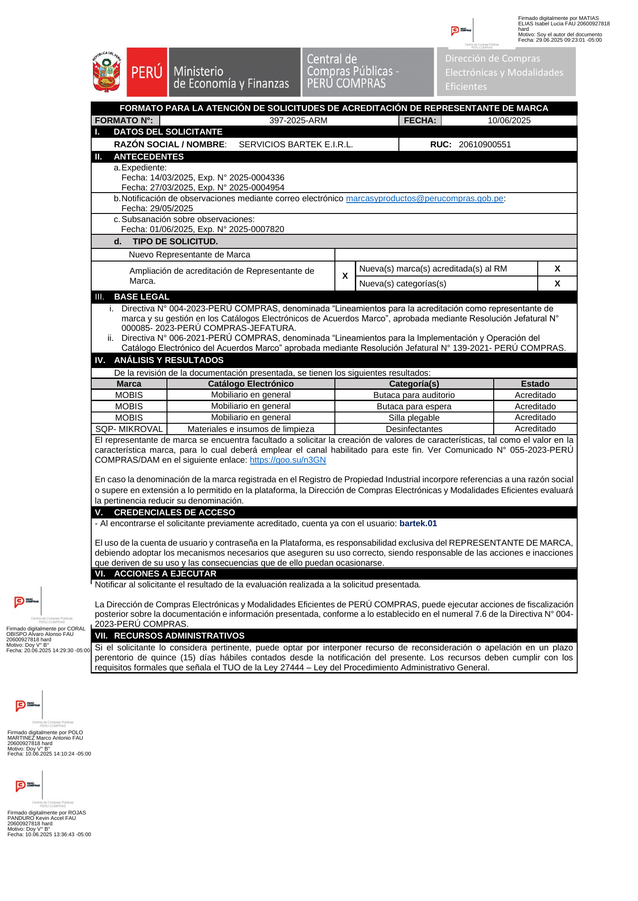
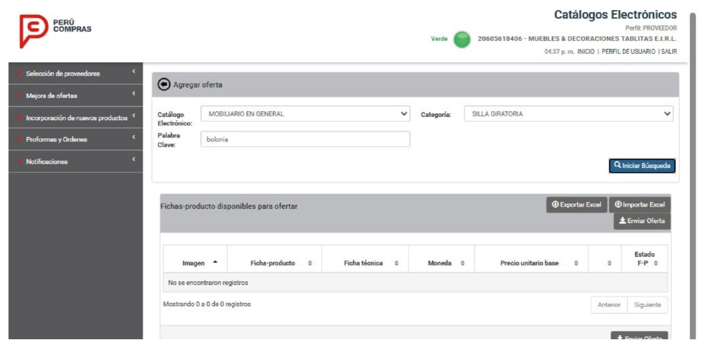
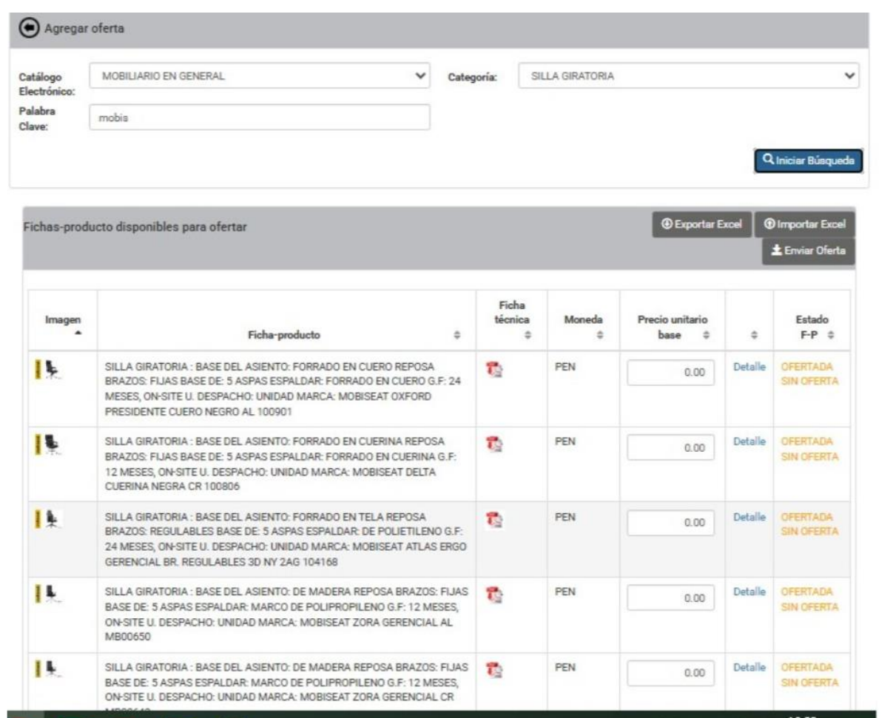
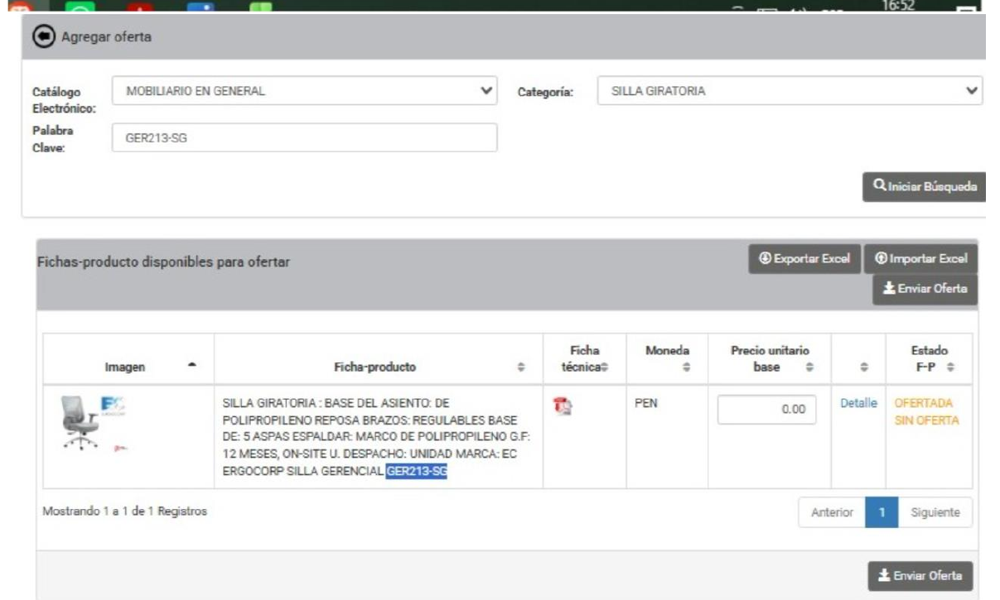

Lima, [DÍA] de octubre de 2026

**CARTA N.° [___]-2026-SERVICIOS BARTEK E.I.R.L.**

Señores
**DIRECCIÓN DE COMPRAS ELECTRÓNICAS Y MODALIDADES EFICIENTES – DCEME**
Central de Compras Públicas – PERÚ COMPRAS
Av. República de Panamá N.° 3629, San Isidro
Presente.–

**ASUNTO:** RECLAMO Y SOLICITUD DE ATENCIÓN URGENTE. Los proveedores no pueden visualizar ni ofertar las fichas-producto de la marca **MOBIS** en la plataforma de Catálogos Electrónicos.

**REFERENCIA:** Formato N.° 397-2025-ARM, del 10 de junio de 2025, que acredita a SERVICIOS BARTEK E.I.R.L. como representante de la marca MOBIS.

---

De nuestra consideración:

**SERVICIOS BARTEK E.I.R.L.**, con RUC N.° **20610900551**, debidamente representada por su Gerente, **FAVIOLA ORIHUELA PIMENTEL**, identificada con DNI N.° **10790531**, se dirige a ustedes para presentar un **RECLAMO** y solicitar su **atención urgente** sobre un problema que afecta directamente a nuestra marca **MOBIS** en la plataforma de Catálogos Electrónicos.

## 1. NUESTRA ACREDITACIÓN

**1.1.** Mediante el **Formato N.° 397-2025-ARM**, del 10 de junio de 2025, su propia Dirección acreditó a nuestra empresa como **representante de la marca MOBIS** en el Catálogo Electrónico **Mobiliario en General**, en las categorías:

| Marca | Catálogo Electrónico | Categoría | Estado |
|---|---|---|---|
| MOBIS | Mobiliario en general | Butaca para auditorio | Acreditado |
| MOBIS | Mobiliario en general | Butaca para espera | Acreditado |
| MOBIS | Mobiliario en general | Silla plegable | Acreditado |

**1.2.** Es decir, **nuestra acreditación está vigente desde hace más de un año**. Durante ese tiempo hemos cumplido con todo lo que PERÚ COMPRAS nos ha exigido como representante de marca.

## 2. LOS HECHOS

**2.1.** El **viernes 2 de octubre de 2026**, varios proveedores nos informaron que **no pueden ver las fichas-producto de la marca MOBIS en la plataforma** y que, por lo tanto, **no pueden subirlas ni ofertarlas**.

**2.2.** Uno de ellos nos indicó textualmente que había recibido por correo nuestro stock, **“pero no logro ver su marca en Perú Compras en plataforma”**. Otros proveedores nos enviaron capturas del módulo *“Agregar oferta”* en las que la búsqueda da como resultado **“No se encontraron registros”**, mientras que las fichas de **otras marcas sí aparecen** y se pueden ofertar con normalidad (ver Anexos 2 y 3).

**2.3.** Este problema es especialmente grave porque **los proveedores solo pueden subir sus fichas a la plataforma del 01 al 09 de cada mes**. Al día de hoy, **el periodo de octubre vence el viernes 9 de octubre de 2026**. Si las fichas MOBIS no se habilitan antes de esa fecha, los proveedores **perderán todo el mes** sin poder ofertar nuestra marca.

**2.4.** **No hemos recibido ninguna comunicación** de PERÚ COMPRAS que nos informe de una suspensión, exclusión, observación o cambio en el estado de nuestras fichas. Nos enteramos del problema **por los propios proveedores**, no por la entidad.

## 3. NUESTRA PREOCUPACIÓN

**3.1.** **No sabemos desde cuándo ocurre este problema.** Pudo empezar hace días, semanas o meses. Si las fichas MOBIS llevan tiempo sin ser visibles, los proveedores pueden haber perdido **uno o varios periodos mensuales de carga**, y **nosotros hemos perdido ventas sin saberlo**, y las entidades públicas han perdido una opción válida para comprar.

**3.2.** Lo decimos con claridad: que nuestras fichas desaparezcan para los proveedores **sin aviso y sin explicación**, mientras las de otras marcas funcionan con normalidad, **nos genera serias dudas sobre el actuar de la entidad**. Necesitamos que PERÚ COMPRAS nos explique, por escrito, qué ha pasado.

**3.3.** Las contrataciones del Estado se rigen por el principio de **libertad de concurrencia**. Este principio garantiza que **todos los proveedores que cumplan con los requisitos tengan la misma oportunidad de participar, competir y venderle al Estado**, y prohíbe los **monopolios, los favoritismos y las barreras innecesarias**. Impedir que los proveedores vean y oferten una marca debidamente acreditada es precisamente una de esas barreras.

**3.4.** Esta situación afecta también:

- **La pluralidad de postores:** el Estado debe buscar que existan **múltiples opciones y participantes**. Si se dejan fuera las fichas MOBIS, la competencia se reduce a las marcas que el sistema sí muestra.
- **La transparencia y la igualdad de trato:** las reglas deben ser **claras y las mismas para todos**. Si las fichas de otras marcas funcionan y las nuestras no, la entidad debe explicar por qué.

## 4. LO QUE SOLICITAMOS

Por lo expuesto, **SOLICITAMOS**:

1. **Se habiliten de inmediato, en un plazo no mayor de veinticuatro (24) horas** y en todo caso **antes del cierre del periodo de carga del 9 de octubre de 2026**, todas las fichas-producto de la marca **MOBIS**, en todas las categorías en las que estamos acreditados, para que los proveedores las vean y puedan ofertarlas sin restricción.
2. **Si no fuera posible habilitarlas antes del 9 de octubre**, se otorgue a los proveedores un **plazo extraordinario** para subir las fichas MOBIS, equivalente a los días perdidos por causas ajenas a ellos y a nosotros.
3. **Se nos informe por escrito**, en un plazo **no mayor de cinco (5) días hábiles**:
   a) La **causa** por la que las fichas MOBIS no son visibles para los proveedores.
   b) **Desde qué fecha** ocurre este problema.
   c) Si existió alguna **decisión, observación, suspensión o cambio** sobre nuestras fichas o nuestra marca y, de ser así, **quién la tomó, cuándo y con qué sustento**, y por qué **no se nos notificó**.
   d) Si el problema **afecta a otras marcas** o solo a la marca MOBIS.
4. **Se adopten las medidas** necesarias para que esto no se repita, y se nos **notifique** de manera oportuna cualquier cambio que afecte a nuestras fichas.
5. **Se garantice** que las fichas MOBIS reciban **el mismo trato** que las de las demás marcas del catálogo, en respeto de los principios de **libertad de concurrencia, pluralidad de postores, transparencia e igualdad de trato**.

Esta solicitud se presenta en ejercicio de nuestro **derecho de petición**, reconocido en el **artículo 2, inciso 20 de la Constitución Política del Perú** y en el **TUO de la Ley N.° 27444, Ley del Procedimiento Administrativo General**.

## 5. RESERVA DE DERECHOS

De no recibir una respuesta oportuna y satisfactoria, **nos reservamos el derecho de acudir a las instancias correspondientes**, entre ellas el **Órgano de Control Institucional (OCI) de PERÚ COMPRAS**, la **Contraloría General de la República** y la **Defensoría del Pueblo**, así como de **reclamar los daños y perjuicios** que esta situación nos haya causado.

Confiamos en que su Dirección atenderá este pedido con la urgencia que corresponde, considerando que **el periodo de carga de fichas vence el 9 de octubre de 2026**.

Atentamente,

&nbsp;

&nbsp;

\_\_\_\_\_\_\_\_\_\_\_\_\_\_\_\_\_\_\_\_\_\_\_\_\_\_\_\_\_\_\_\_\_\_\_
**FAVIOLA ORIHUELA PIMENTEL**
DNI N.° 10790531
Gerente
**SERVICIOS BARTEK E.I.R.L.** – RUC N.° 20610900551
Correo: serviciosbartek@gmail.com · Teléfono: [___________]
Domicilio: [______________________]

---

**ANEXOS:**

- **Anexo 1:** Formato N.° 397-2025-ARM, del 10 de junio de 2025 (acreditación como representante de la marca MOBIS).
- **Anexo 2:** Mensaje del proveedor del 2 de octubre de 2026 que informa que no encuentra la marca MOBIS en la plataforma.
- **Anexo 3:** Capturas de la plataforma de Catálogos Electrónicos (perfil proveedor), módulo “Agregar oferta”.

```{=openxml}
<w:p><w:r><w:br w:type="page"/></w:r></w:p>
```

## ANEXO 1 – Formato N.° 397-2025-ARM (acreditación de la marca MOBIS)

{width=16cm}

```{=openxml}
<w:p><w:r><w:br w:type="page"/></w:r></w:p>
```

## ANEXO 2 – Mensaje del proveedor (2 de octubre de 2026)

[INSERTAR AQUÍ LA CAPTURA DE WHATSAPP DEL PROVEEDOR, CON SU NÚMERO DE TELÉFONO TAPADO]

El proveedor indica: *“Disculpe, me llegó un correo con el stock de su marca, pero no logro ver su marca en Perú Compras en plataforma.”*

```{=openxml}
<w:p><w:r><w:br w:type="page"/></w:r></w:p>
```

## ANEXO 3 – Capturas de la plataforma (perfil proveedor)

**3.1. Búsqueda de un modelo de la marca MOBIS: “No se encontraron registros”.**

{width=16cm}

**3.2. Búsqueda “mobis”: el sistema muestra fichas de otra marca (MOBISEAT), pero no las de MOBIS.**

{width=12cm}

**3.3. En cambio, las fichas de otras marcas sí aparecen y se pueden ofertar (ejemplo: EC ERGOCORP – GER213-SG).**

{width=12cm}
