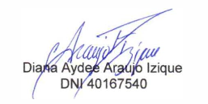
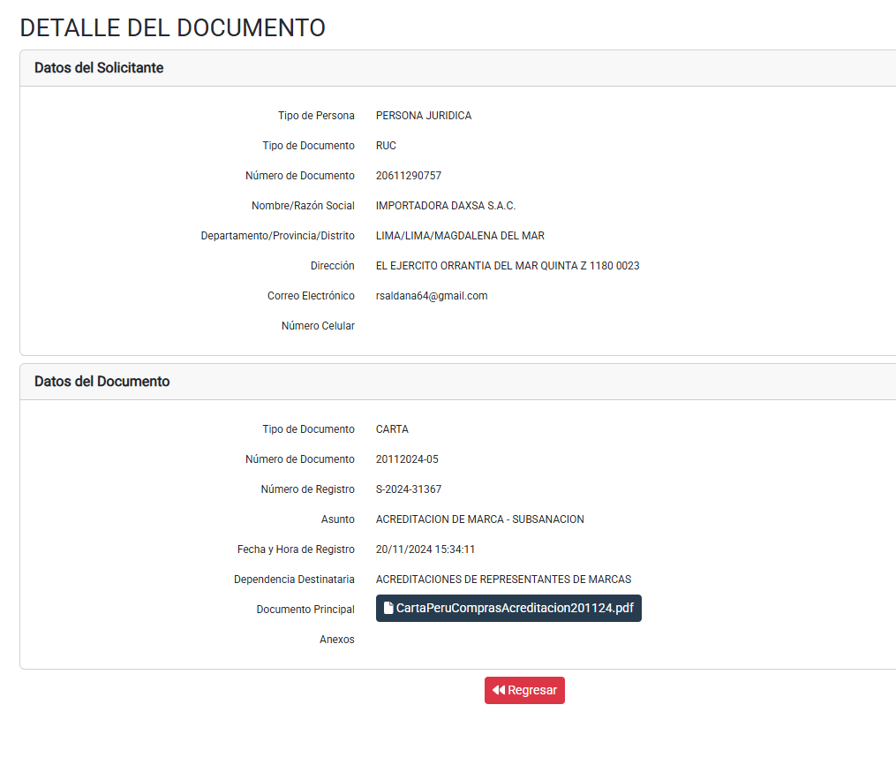
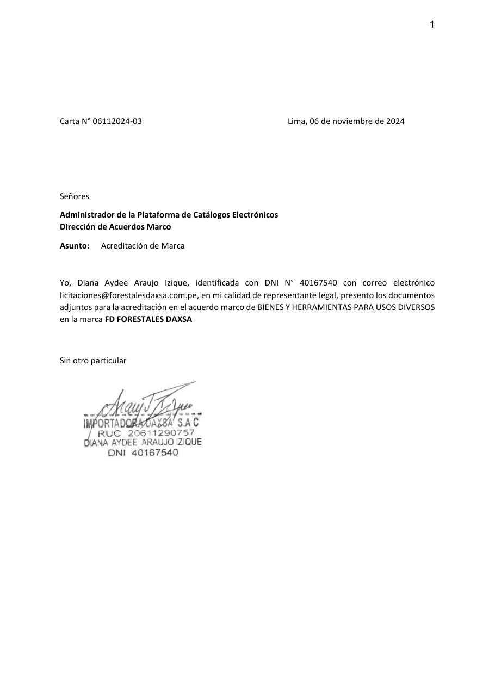
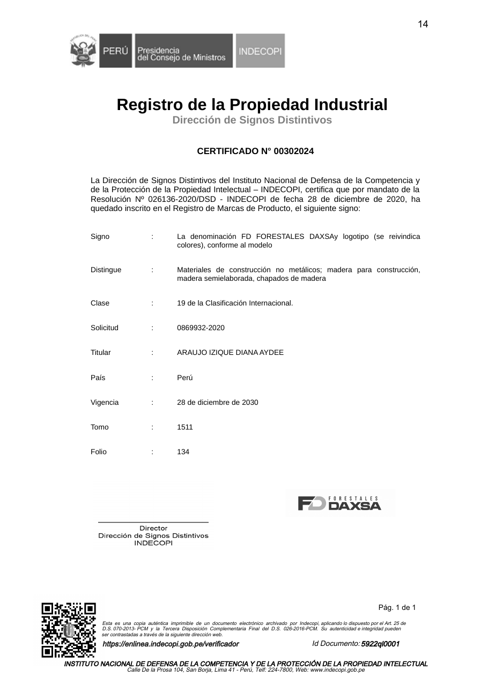

Lima, 09 de octubre de 2026

**CARTA N.° 09102026-01-IMPORTADORA DAXSA S.A.C.**

Señor
**NEAL MARTÍN MAURA GONZALES**
Director de la Dirección de Compras Electrónicas y Modalidades Eficientes – DCEME
Central de Compras Públicas – **PERÚ COMPRAS**
Av. República de Panamá N.° 3629, San Isidro, Lima
Presente.–

**ASUNTO:** SOLICITUD DE COPIA DEL DOCUMENTO DE ACREDITACIÓN, CONFIRMACIÓN DE VIGENCIA E INDICACIONES PARA EL REGISTRO DE FICHAS-PRODUCTO de la marca **FD FORESTALES DAXSA** – Acuerdo Marco **EXT-CE-2024-16 – Accesorios Domésticos y Bienes para Usos Diversos**.

**REFERENCIAS:**

a) Carta N.° 06112024-03, del 06 de noviembre de 2024: solicitud de acreditación como representante de la marca FD FORESTALES DAXSA.
b) Carta N.° 20112024-05, del 20 de noviembre de 2024: subsanación de la solicitud – **Registro N.° S-2024-31367** (20/11/2024, 15:34), dirigida a Acreditaciones de Representantes de Marcas.

---

De nuestra consideración:

**IMPORTADORA DAXSA S.A.C.**, con RUC N.° **20611290757**, debidamente representada por su Gerente General, **DIANA AYDEE ARAUJO IZIQUE**, identificada con DNI N.° **40167540**, se dirige a su Dirección para solicitar **copia del documento que nos acreditó** como representante de marca, la **confirmación de su vigencia** en el Acuerdo Marco actual y las **indicaciones para registrar nuestras fichas-producto**.

## 1. ANTECEDENTES

**1.1.** El **06 de noviembre de 2024** solicitamos nuestra acreditación como representante de marca, conforme a la Directiva N.° 004-2023-PERÚ COMPRAS, respecto de:

| Marca | Catálogo Electrónico (solicitud 2024) | Categoría |
|---|---|---|
| **FD FORESTALES DAXSA** | Bienes y Herramientas para Usos Diversos | Bienes para Usos Diversos |

Actualmente, los bienes de esta categoría se contratan a través del Acuerdo Marco **EXT-CE-2024-16 – Accesorios Domésticos y Bienes para Usos Diversos**.

**1.2.** La marca **FD FORESTALES DAXSA** se encuentra registrada ante INDECOPI mediante el **Certificado N.° 00302024** (Resolución N.° 026136-2020/DSD-INDECOPI), en la **Clase 19** de la Clasificación Internacional, **vigente hasta el 28 de diciembre de 2030**. Su titular, la Sra. Diana Aydee Araujo Izique, autorizó a nuestra empresa a ejercer las atribuciones de representante de marca (Anexo 4 de la Directiva).

**1.3.** El **20 de noviembre de 2024** presentamos la **subsanación** de nuestra solicitud, registrada con el **N.° S-2024-31367** y dirigida al área de Acreditaciones de Representantes de Marcas.

**1.4.** Entendemos que, tras la subsanación, **nuestra empresa fue acreditada** como representante de la marca. Sin embargo, **no conservamos la notificación** de acreditación remitida por correo electrónico, ni el **Formato o documento de acreditación** correspondiente, ni los datos de la **credencial de acceso** a la Plataforma. Necesitamos esa información para **registrar nuestras fichas-producto** en el Acuerdo Marco **EXT-CE-2024-16**, que es el actualmente vigente para nuestra categoría.

## 2. FUNDAMENTO

**2.1.** La **Directiva N.° 004-2023-PERÚ COMPRAS** establece que, presentada la subsanación, la Dirección **verifica su cumplimiento en un plazo de diez (10) días hábiles** (numeral 8.2.3) y, de corresponder, **acredita al solicitante** y le **notifica** la acreditación y su credencial de acceso a la Plataforma **a través del correo electrónico autorizado** (numeral 8.2.4).

**2.2.** El propio formato de solicitud de acreditación (Anexo 1 de la Directiva) precisa que, **“en caso varíe la denominación (...) del Catálogo Electrónico o de la categoría, o de ambos, la acreditación del representante de marca se mantiene”**. Asimismo, la Directiva dispone que la acreditación **se mantiene vigente mientras el Catálogo Electrónico se encuentre vigente** (numeral 7.8), y que PERÚ COMPRAS puede requerir al representante de marca información o documentación durante la vigencia del Catálogo (numeral 7.10). Por ello es indispensable conocer con precisión el estado de nuestra acreditación.

**2.3.** Formulamos la presente en ejercicio de nuestro **derecho de petición**, reconocido en el **artículo 2, inciso 20 de la Constitución Política del Perú** y en el **TUO de la Ley N.° 27444, Ley del Procedimiento Administrativo General**.

## 3. LO QUE SOLICITAMOS

Solicitamos que, en un plazo **no mayor de diez (10) días hábiles**, su Dirección nos remita al correo electrónico consignado en la presente:

1. **Copia del Formato o documento de acreditación** de IMPORTADORA DAXSA S.A.C. como representante de la marca **FD FORESTALES DAXSA**, con su **número, fecha** y las **categorías** comprendidas.
2. La **confirmación de que dicha acreditación se mantiene vigente** en el Acuerdo Marco **EXT-CE-2024-16 – Accesorios Domésticos y Bienes para Usos Diversos**, y en qué **catálogo(s) y categoría(s)**. Si para operar en este Acuerdo Marco corresponde una **nueva acreditación o una ampliación**, se nos indique el procedimiento.
3. Los **datos de nuestra credencial de acceso** (usuario) a la Plataforma de Catálogos Electrónicos y, de ser necesario, el procedimiento para **restablecer la contraseña**.
4. Las **indicaciones para registrar nuestras fichas-producto**: el **procedimiento**, los **periodos habilitados** para la incorporación de fichas, los **requisitos y documentos** que debemos adjuntar, y los **manuales o guías** disponibles.
5. Si, como consecuencia del cambio de titularidad de la Dirección, corresponde **suscribir nuevamente el Acuerdo de Adhesión** o actualizar documentación; de ser así, se nos remitan los formatos correspondientes.

Agradecemos de antemano su atención.

Atentamente,

{width=5.5cm}

**DIANA AYDEE ARAUJO IZIQUE**
DNI N.° 40167540
Gerente General
**IMPORTADORA DAXSA S.A.C.** – RUC N.° 20611290757
Domicilio: El Ejército, Orrantia del Mar, Quinta Z 1180 – 0023, Magdalena del Mar, Lima
Correo: licitaciones@forestalesdaxsa.com.pe · Celular: 986045123

---

**ANEXOS:**

- **Anexo 1:** Constancia del Registro N.° S-2024-31367 (subsanación del 20/11/2024).
- **Anexo 2:** Carta N.° 06112024-03, del 06/11/2024 (solicitud de acreditación).
- **Anexo 3:** Certificado de INDECOPI N.° 00302024 de la marca FD FORESTALES DAXSA.

```{=openxml}
<w:p><w:r><w:br w:type="page"/></w:r></w:p>
```

{width=16cm}

**Anexo 1 – Registro N.° S-2024-31367: subsanación de la acreditación de marca, presentada el 20/11/2024.**

```{=openxml}
<w:p><w:r><w:br w:type="page"/></w:r></w:p>
```

{width=13cm}

**Anexo 2 – Carta N.° 06112024-03, del 06/11/2024: solicitud de acreditación de la marca FD FORESTALES DAXSA.**

```{=openxml}
<w:p><w:r><w:br w:type="page"/></w:r></w:p>
```

{width=13cm}

**Anexo 3 – Certificado de INDECOPI N.° 00302024: marca FD FORESTALES DAXSA, Clase 19, vigente hasta el 28/12/2030.**
