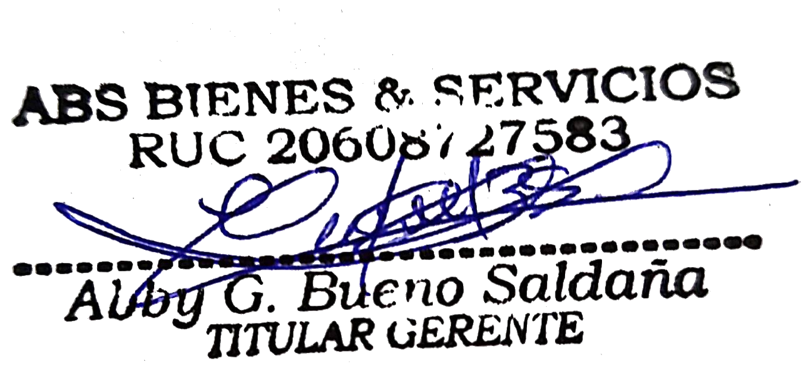

Lima, 07 de octubre de 2026

**CARTA N.° 359-2026-ABS BIENES & SERVICIOS E.I.R.L.**

Señores
**DEFENSORÍA DEL PUEBLO**
Dirección de Atención al Pueblo
consulta@defensoria.gob.pe
Presente.–

**ASUNTO:** QUEJA contra la **Municipalidad Provincial de Huaura – Huacho** por **vulneración del derecho de petición** y **negativa a pagar** una deuda derivada de la Orden de Compra **OCAM-2022-301371-25-0 / 25-1**, pendiente desde julio de 2022.

**REFERENCIAS:**

a) **Expediente N.° 3000-2024-014374** (registrado el 30/05/2024) y **Expediente N.° 3000-2024-014947** (registrado el 06/06/2024) de la Dirección de Atención al Pueblo.
b) Nuestra carta a la Defensoría del Pueblo del 24 de mayo de 2024 (Carta N.° 340-2024 ABS BIENES & SERVICIOS EIRL).
c) Oficio N.° 003413-2026-PERÚ COMPRAS-DCEME, del 21 de julio de 2026.

---

De nuestra consideración:

**ABS BIENES & SERVICIOS E.I.R.L.**, con RUC N.° **20608727583**, debidamente representada por su Titular Gerente, **ABBY GABRIELA BUENO SALDAÑA**, identificada con DNI N.° **48054321**, se dirige a ustedes a la Defensoría del Pueblo para presentar una **QUEJA** contra la **Municipalidad Provincial de Huaura – Huacho**, que desde hace más de tres años **se niega a pagarnos** por bienes que le entregamos y **no responde ninguna de nuestras comunicaciones**. Ya acudimos a la Defensoría en mayo de 2024 y **hemos cumplido con todo lo que se nos orientó**; la Municipalidad sigue sin responder ni pagar.

## 1. LOS HECHOS

**1.1.** A través de los Catálogos Electrónicos de Acuerdos Marco de PERÚ COMPRAS (Acuerdo Marco EXT-CE-2021-10), la **Municipalidad Provincial de Huaura – Huacho** (RUC N.° 20141418557) nos compró **cuatro (4) neumáticos** para vehículos pesados (Orden de Compra física N.° 000146, del 04/07/2022, y **OCAM-2022-301371-25-0 / OCAM-2022-301371-25-1**), por **S/ 5,223.39**.

**1.2.** **Entregamos los bienes el 20 de julio de 2022** (Guía de Remisión EG01-6, con sello de recepción de la Municipalidad) y emitimos la Factura Electrónica E001-17. **Más de tres (3) años y dos (2) meses después, no hemos recibido ningún pago.**

**1.3.** La consulta del **Expediente SIAF N.° 3619-2022** de la propia Municipalidad muestra que:

- Se registró un **giro de S/ 3,482.27 el 26 de enero de 2023** (Documento N.° 0103) que **nuestra empresa nunca recibió**.
- Se **rebajaron S/ 1,741.12** mediante el **Memorándum N.° 472-2023-OGAF**, sin que se nos notificara penalidad ni motivo alguno.

**1.4.** En setiembre de 2023, la Gerencia Municipal pidió un informe sobre el estado de pago (Memorándum N.° 000836-MPH/GM) y la Oficina General de Administración y Finanzas lo derivó (Proveído N.° 003811-MPH/OGAF, Expediente N.° 00655163). Luego se nos informó que **el expediente se había extraviado**.

**1.5.** **PERÚ COMPRAS ha requerido a la Municipalidad en cinco oportunidades** y ha verificado que la orden está **“ENTREGADA C/CONFORMIDAD RETRASADA”**: Oficio N.° 12475-2023-PERÚ COMPRAS-DAM (a la OGAF); Oficio N.° 001886-2024 (14/02/2024, al OCI); Oficio N.° 004143-2024 (26/03/2024, a la Contraloría General de la República); Oficio N.° 006119-2024 (28/05/2024, a la OGAF); y **Oficio N.° 003413-2026-PERÚ COMPRAS-DCEME** (21/07/2026, al OCI con copia al Alcalde), en el que concluye: *“corroborándose el incumplimiento de la Entidad”*.

**1.6.** Hemos enviado **más de diez comunicaciones** a la Municipalidad, a PERÚ COMPRAS y a la Defensoría del Pueblo desde 2023. **La Municipalidad no ha respondido ninguna.** Con fecha 07 de octubre de 2026 le hemos cursado un **último requerimiento de pago** (Anexo 1).

## 2. HEMOS CUMPLIDO LO QUE LA DEFENSORÍA NOS ORIENTÓ

En los Expedientes N.° 3000-2024-014374 y N.° 3000-2024-014947, la Dirección de Atención al Pueblo nos orientó a: **(i)** presentar **requerimientos de pago** ante la Municipalidad; **(ii)** solicitar la **reconstrucción del expediente administrativo**; y **(iii)** si en un plazo de **30 días hábiles** no recibíamos respuesta, **remitir la documentación** a la Defensoría. **Hemos cumplido con todo:**

| Orientación de la Defensoría | Lo que hicimos |
|---|---|
| Presentar requerimientos de pago ante la Municipalidad | Cartas a la Oficina General de Administración y Finanzas del **13/03/2025** (N.° 13032025), **28/04/2025** (N.° 28042025), **02/07/2026** (N.° 355-2026) y **03/08/2026** (N.° 356-2026), con copia al Alcalde y al OCI, y último requerimiento al Alcalde del **07/10/2026** (Anexo 1). |
| Solicitar la reconstrucción del expediente | Solicitada expresamente en nuestra carta al Alcalde del **07/10/2026**, adjuntando **todos los antecedentes** (Anexo 1). |
| Esperar 30 días hábiles | Desde nuestro primer requerimiento del 13/03/2025 han pasado **más de dieciocho (18) meses**. **No hemos recibido ninguna respuesta.** |

Por ello, **remitimos la documentación** y solicitamos la intervención de la Defensoría.

## 3. DERECHOS VULNERADOS

**3.1. Derecho de petición.** El **artículo 2, inciso 20 de la Constitución Política del Perú** reconoce el derecho de toda persona a formular peticiones a la autoridad, **la que está obligada a dar respuesta por escrito dentro del plazo legal**. La Municipalidad **no ha respondido ninguna** de nuestras cartas desde 2023, en contra de lo dispuesto también por el **TUO de la Ley N.° 27444, Ley del Procedimiento Administrativo General**.

**3.2. Incumplimiento de deberes de la administración.** La Municipalidad **recibió los bienes y no paga**, pese a que la normativa de contrataciones del Estado le obliga a hacerlo en un plazo de días:

- **Numeral 171.1 del artículo 171 del Reglamento de la Ley de Contrataciones del Estado (D.S. N.° 344-2018-EF):** la Entidad debe pagar *“dentro de los diez (10) días calendarios siguientes a la conformidad (...), bajo responsabilidad del funcionario competente”*, y *“en caso de retraso de pago, el contratista tiene derecho al pago de intereses legales”*.
- **Numeral 67.3 del artículo 67 de la Ley N.° 32069, Ley General de Contrataciones Públicas:** el pago se realiza en un plazo máximo de diez (10) días hábiles luego de la conformidad.
- **Numeral 67.4 del artículo 67 de la Ley N.° 32069:** constituyen **faltas graves** de la autoridad de gestión administrativa *“el incumplimiento, negación o demora, de manera injustificada, del pago al contratista”*, y es **falta muy grave** que el contratista deba iniciar acciones legales por ello.

**3.3. Afectación a una pequeña empresa.** Somos una pequeña empresa peruana que **cumplió con lo pactado**. La negativa de la Municipalidad a pagar, durante más de tres años, nos causa un perjuicio económico directo y desalienta la participación de pequeños proveedores en las compras del Estado.

**3.4.** Conforme al **artículo 162 de la Constitución Política del Perú**, corresponde a la Defensoría del Pueblo **defender los derechos constitucionales** de la persona y **supervisar el cumplimiento de los deberes de la administración estatal**.

## 4. LO QUE SOLICITAMOS

1. Que se **admita la presente queja** y se le asigne un número de expediente.
2. Que la Defensoría del Pueblo **intervenga ante la Municipalidad Provincial de Huaura – Huacho** para que **responda nuestras comunicaciones** y **cumpla con el pago** de S/ 5,223.39 más intereses legales.
3. Que se **recomiende a la Municipalidad** atender nuestra solicitud de **reconstrucción del expediente** y que informe el destino del **giro de S/ 3,482.27** registrado en el SIAF y el sustento de la **rebaja de S/ 1,741.12**.
4. Que se nos **informe** las acciones adoptadas.

Atentamente,

{width=6cm}

**ABBY GABRIELA BUENO SALDAÑA**
DNI N.° 48054321
Titular Gerente
**ABS BIENES & SERVICIOS E.I.R.L.** – RUC N.° 20608727583
Domicilio: Calle Giuseppe Verdi N.° 951, Urb. Primavera, Trujillo, La Libertad
Correo: abs.comercial2@gmail.com · Celular: 986045123

**ANEXOS:**

- **Anexo 1:** Carta N.° 357-2026-ABS BIENES & SERVICIOS E.I.R.L. dirigida al Alcalde de la Municipalidad Provincial de Huaura – Huacho, del 07/10/2026, con sus anexos (orden de compra, guía de remisión con sello de recepción, factura, carta de autorización de abono, consulta SIAF, expediente interno y oficio de PERÚ COMPRAS).
- **Anexo 2:** Carta N.° 340-2024 a la Defensoría del Pueblo, del 24/05/2024.
- **Anexo 3:** Oficio N.° 003413-2026-PERÚ COMPRAS-DCEME, del 21/07/2026.
