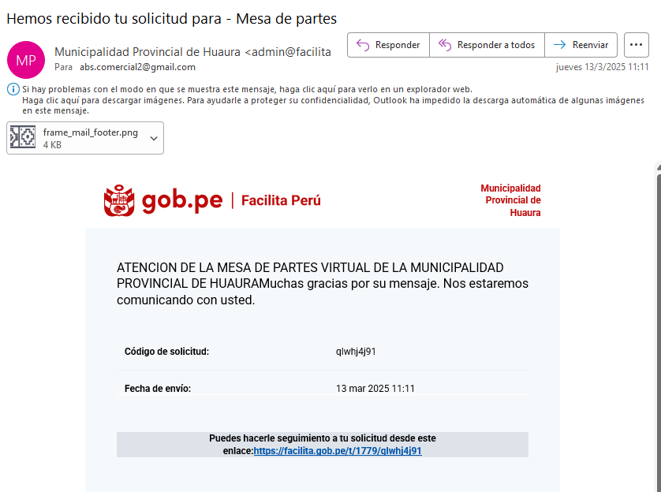
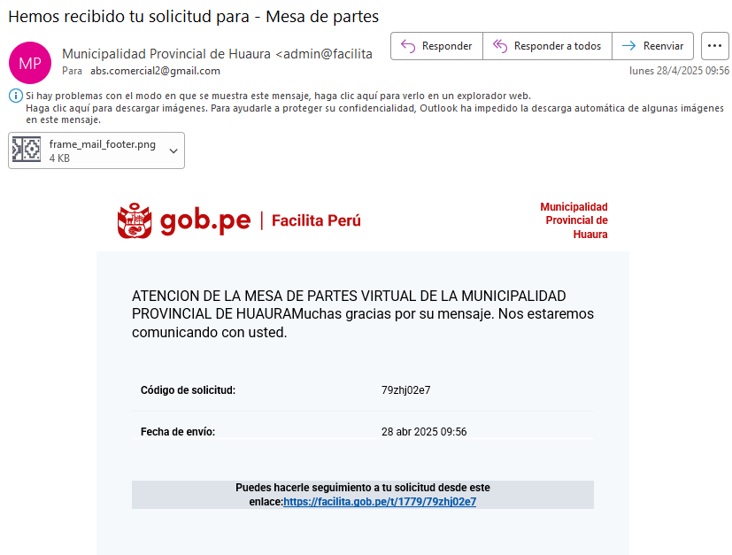
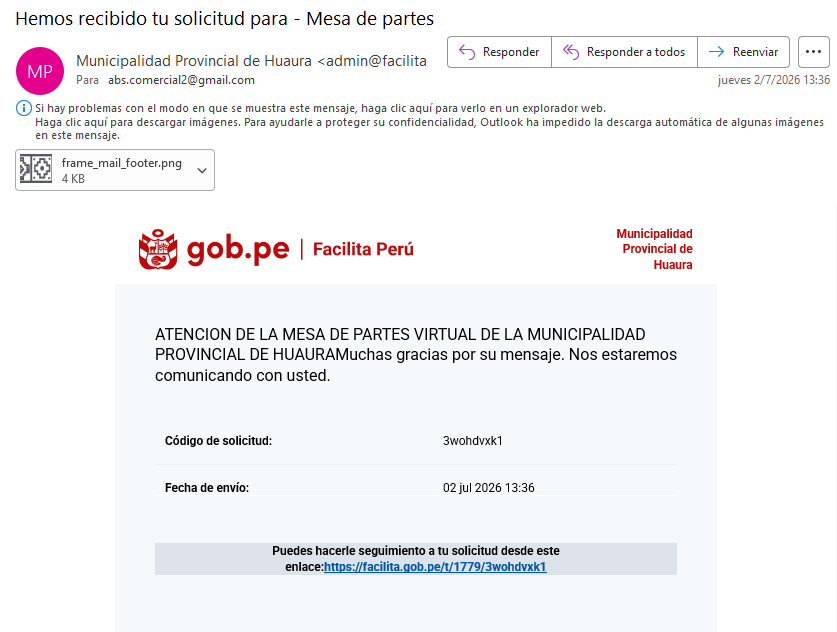
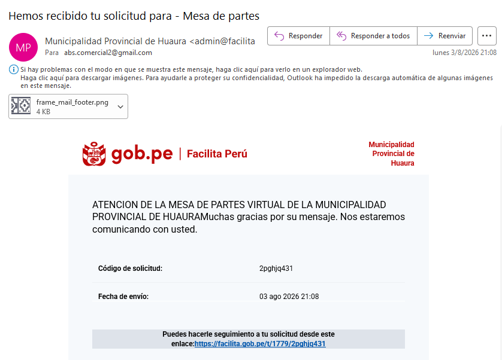
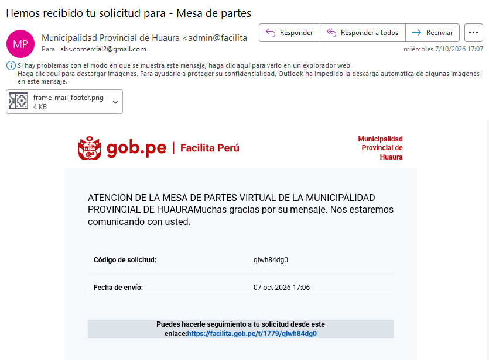

Lima, 09 de octubre de 2026

**CARTA N.° 09102026-2-ABS BIENES & SERVICIOS E.I.R.L.**

Señores
**DEFENSORÍA DEL PUEBLO**
**Oficina Defensorial de Lima Provincias**
Presente.–

**ASUNTO:** REMISIÓN DE INFORMACIÓN COMPLEMENTARIA – Queja contra la Municipalidad Provincial de Huaura – Huacho por falta de pago de la Orden de Compra N.° 000146 / OCAM-2022-301371-25-0.

**REFERENCIAS:**

a) N.° de ingreso **2026-000336-LIMA PROVINCIAS** (Carta N.° 01102026-3, del 07/10/2026).
b) Expedientes N.° 3000-2024-014374 y N.° 3000-2024-014947 de la Dirección de Atención al Pueblo.
c) Comunicación telefónica de su despacho.

---

De nuestra consideración:

**ABS BIENES & SERVICIOS E.I.R.L.**, con RUC N.° **20608727583**, representada por su Titular Gerente, **ABBY GABRIELA BUENO SALDAÑA**, identificada con DNI N.° **48054321**, en atención a lo solicitado telefónicamente por su despacho, remite la **carta completa** de nuestra queja y los **cargos de los requerimientos de pago** presentados ante la Municipalidad Provincial de Huaura – Huacho, con sus números de registro.

**1. Requerimientos de pago presentados ante la Municipalidad**

Todos fueron presentados por la **Mesa de Partes Virtual de la Municipalidad (Facilita Perú)**, que emitió el código de registro indicado. **Ninguno ha sido respondido.**

| N.° | Fecha y hora | Documento | Dirigido a | Código de registro |
|---|---|---|---|---|
| 1 | 13/03/2025 – 11:11 | Carta N.° 13032025 | Jefa de la Oficina General de Administración y Finanzas | **qlwhj4j91** |
| 2 | 28/04/2025 – 09:56 | Carta N.° 28042025 | Jefa de la Oficina General de Administración y Finanzas | **79zhj02e7** |
| 3 | 02/07/2026 – 13:36 | Carta N.° 355-2026 | Jefa de la Oficina General de Administración y Finanzas | **3wohdvxk1** |
| 4 | 03/08/2026 – 21:08 | Carta N.° 356-2026 | Jefa de la Oficina General de Administración y Finanzas | **2pghjq431** |
| 5 | 07/10/2026 – 17:06 | Carta N.° 07102026-1 | Alcalde Provincial | **qlwh84dg0** – registrada como **DOC 2621771, EXP 655163** |

Antes de estas cartas, acudimos personalmente a la Municipalidad el **29/09/2023** y en **octubre de 2023**.

**2. Otras gestiones realizadas**

| Fecha | Entidad | Documento | Registro |
|---|---|---|---|
| 2023 – 2024 | PERÚ COMPRAS | Cartas N.° 255-2023, 120-2024, 350-2024 y 20092024-1 | Dieron lugar a los Oficios N.° 12475-2023, 001886-2024, 004143-2024 y 006119-2024-PERÚ COMPRAS-DAM |
| 21/07/2026 | PERÚ COMPRAS | Oficio N.° 003413-2026-PERÚ COMPRAS-DCEME (al OCI, con copia al Alcalde) | Corrobora el incumplimiento de la Municipalidad |
| 07/10/2026 | PERÚ COMPRAS | Carta N.° 07102026-5 | **Exp. N.° 2026-0008933** |
| 07/10/2026 | Contraloría General de la República | Carta N.° 07102026-4 (denuncia) | Cargo de recepción del 07/10/2026, 18:43 |
| 09/10/2026 | Órgano de Control Institucional de la Municipalidad | Carta N.° 07102026-2 | Remitida a ocimunihuacho@gmail.com |

**3. Hecho relevante**

La Municipalidad registró nuestra carta del 07/10/2026 dentro del **Expediente N.° 655163**, el mismo que en 2023 se nos dijo que se había **extraviado**. El expediente, por tanto, **existe y está activo** en el sistema de la Municipalidad.

**4. Precisión**

El número correcto del expediente SIAF de la Municipalidad es **N.° 3618-2022**, en el que figura un giro de **S/ 3,482.27** del 26/01/2023 que **nunca recibimos**. En nuestra Carta N.° 01102026-3 se consignó por error “3619-2022”.

Agradecemos la intervención de su despacho para que la Municipalidad **responda y pague** la deuda pendiente desde julio de 2022.

Atentamente,

{width=6cm}

**ABBY GABRIELA BUENO SALDAÑA**
DNI N.° 48054321
Titular Gerente
**ABS BIENES & SERVICIOS E.I.R.L.** – RUC N.° 20608727583
Correo: abs.comercial2@gmail.com · Celular: 986045123

---

**ANEXOS:**

- **Anexo 1:** Cargos de la Mesa de Partes Virtual de la Municipalidad (5 requerimientos de pago).
- **Anexo 2:** Requerimientos de pago: Cartas N.° 13032025, 28042025, 355-2026 y 356-2026.
- **Anexo 3:** Carta N.° 01102026-3 completa (queja), con sus anexos, incluida la Carta N.° 07102026-1 al Alcalde.
- **Anexo 4:** Cargo de la Contraloría General de la República y envío al OCI.

```{=openxml}
<w:p><w:r><w:br w:type="page"/></w:r></w:p>
```

**ANEXO 1 – Cargos de la Mesa de Partes Virtual de la Municipalidad**

**1.1. Carta N.° 13032025 – 13/03/2025 – Código qlwhj4j91**

{width=11.5cm}

**1.2. Carta N.° 28042025 – 28/04/2025 – Código 79zhj02e7**

{width=11.5cm}

```{=openxml}
<w:p><w:r><w:br w:type="page"/></w:r></w:p>
```

**1.3. Carta N.° 355-2026 – 02/07/2026 – Código 3wohdvxk1**

{width=11.5cm}

**1.4. Carta N.° 356-2026 – 03/08/2026 – Código 2pghjq431**

{width=11.5cm}

```{=openxml}
<w:p><w:r><w:br w:type="page"/></w:r></w:p>
```

**1.5. Carta N.° 07102026-1 al Alcalde – 07/10/2026 – Código qlwh84dg0 (DOC 2621771 – EXP 655163)**

{width=11.5cm}
